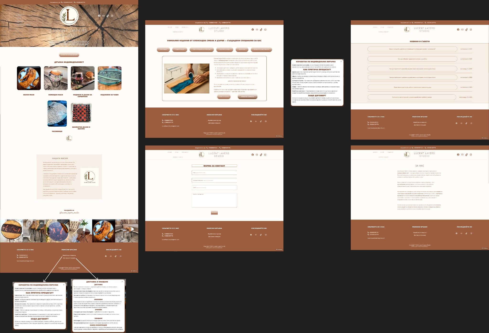
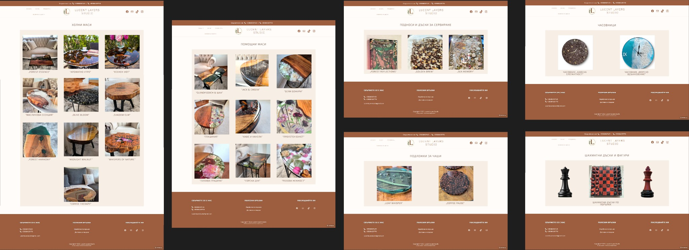
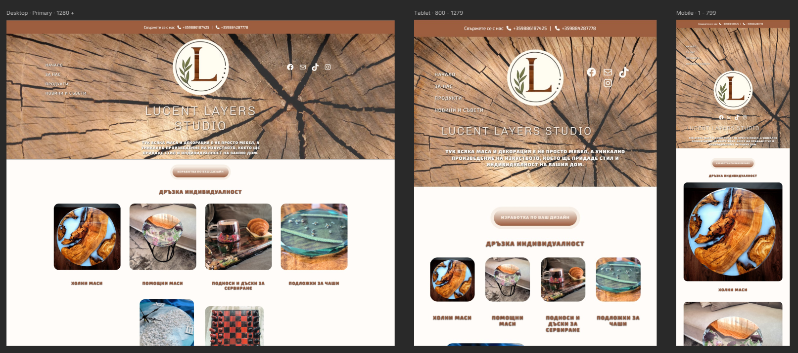

  

<h2 align="center">
  Lucent Layers Studio :tm: Website:
</h2>

 
 This project demonstrates expertise in full-cycle client website development using WordPress, custom CSS / JavaScript, and modern frontend techniques. This repository serves as a portfolio showcase of the custom elements, animations, and technical solutions implemented for this live business site. 
 

 

<h3 align="center">
   💡 Overview & Business Objective:
</h3>

<h3 align="center">  :briefcase: Business Goal:</h3>
  <ul>
    <li>Increase online presense and showcase the poroduct base in a clean way matching the brand.</li>
  </ul>

  <h3 align="center"> :heavy_check_mark: Solution:</h3>
  <ul>
    <li>I have built a scalable WordPress platform focused on intuitive UX and a high-performance frontend, allowing the client to easily update content without touching code.</li>
  </ul>

  

  

  <h3 align="center">
    :dna: Technology Stack:
  </h3>
  
  <h3>Front End:</h3>
  <ul>
    <li>WordPress CMS</li>
    <li>Aether Premium Theme</li>
    <li>HTML</li>
    <li>CSS</li>
    <li>Bootstrap 5</li>
    <li>JavaScript</li>
    <li>Figma</li>
    <li>MP4/GIF Embedding</li>
    <li>Remix Icons</li>
  </ul>

  

  
  <h3 align="center"> :electric_plug: Plugins:</h3>
  <ul>
    <li>Visual Portfolio, Posts & Image Gallery</li>
    <li>FooGallery</li>
    <li>Polylang</li>
  </ul>

  

  
  <h3 align="center"> :trident: Source Control:</h3>
  <ul>
    <li>Git / GitHub (Showcase repository)</li>
  </ul>

  

  

    
  <h3>🎨 Figma Design Mockup</h3>

  
    
  
  
   
  

  <h3>📱 Responsive Design Preview</h3>
    
  

  

  <h3 align="center">  :spider_web: :computer_mouse: Live Site: </h3>
   
 
     :sparkler: www.lucentlayersstudio.eu :sparkler:
   

